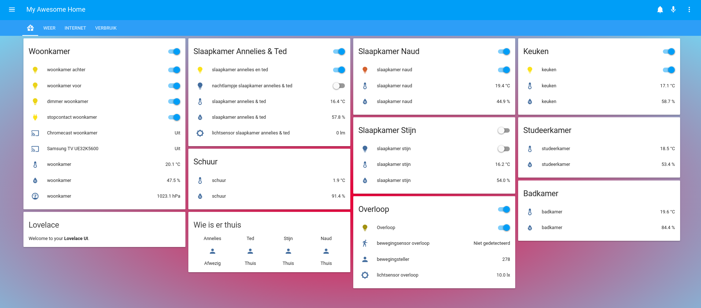
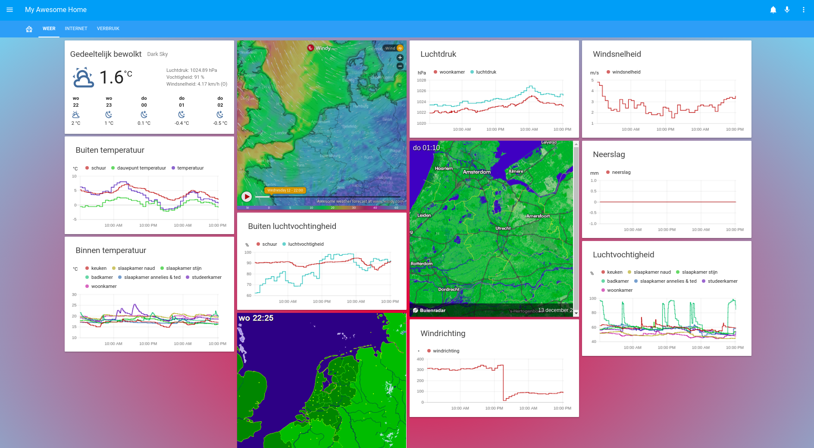

# Home-Assistant configuration  

<html>

.column {
  float: left;
  width: 25%;
  padding: 10px;
}

.column img {
  opacity: 0.8; 
  cursor: pointer; 
}

.column img:hover {
  opacity: 1;
}

.row:after {
  content: "";
  display: table;
  clear: both;
}

.container {
  position: relative;
  display: none;
}

#imgtext {
  position: absolute;
  bottom: 15px;
  left: 15px;
  color: white;
  font-size: 20px;
}

.closebtn {
  position: absolute;
  top: 10px;
  right: 15px;
  color: white;
  font-size: 35px;
  cursor: pointer;
}

  

    
  

  

    
  

  

    
  

  

    
  

  &times;

  

  

function myFunction(imgs) {
  // Get the expanded image
  var expandImg = document.getElementById("expandedImg");
  // Get the image text
  var imgText = document.getElementById("imgtext");
  // Use the same src in the expanded image as the image being clicked on from the grid
  expandImg.src = imgs.src;
  // Use the value of the alt attribute of the clickable image as text inside the expanded image
  imgText.innerHTML = imgs.alt;
  // Show the container element (hidden with CSS)
  expandImg.parentElement.style.display = "block";
}

</html>

  
## Features  
  
* SSL/TLS + duckdns domain name + Lets encrypt certificate
* Samsung TV
* Chromecast
* Hue zigbee bridge
* Hue lights
* Hue dimmer
* Hue check & restart bridge
* Xiaomi Aqara zigbee gateway
* Xiaomi Aqara motion & motion couter
* Xiaomi Aqara temperture, pressure and humidity sensors
* Xiaomi Aqara double switch 
* Xiaomi Aqara power plug
* Xiaomi Aqara door & window sensor
* Xiaomi Aqara viberation sensor
* Sonoff Basic
* Sonoff pow r2
* Sonoff 1CH
* Sonoff RF bridge
* MQTT
* yr Weather api
* darksky Weather api
* Buienrader api
* Luftdaten airquality api
* luchtmeetnet api
* Nederlandse Spoorwegen api (dutch railroad)
* internet speed test api
* Postnl api (package delivery)
* Home-Assistant system monitor
* dsmr p1 - slimme meter (energy consumption)
* host uptime
* Home-assistant Uptime
* certificate expiry time
* Mikrotik router 
* Android ip webcam
* Google maps device tracker

## Installation notes

### Preperations

* install docker
* execute: `sudo systemctl enable docker.service && sudo systemctl start docker.service`
* execute: `sudo mkdir /root/config`
* store home-assistant configuration files in `/root/config/`
* execute: `sudo chmod 766 /root/config/*`
* execute: `sudo mkdir /root/dehydrated`
* execute: `sudo chmod 766 /root/dehydrated/*`
* clone `https://github.com/lukas2511/dehydrated.git` into `/root/dehydrated/`
* configure https://github.com/lukas2511/dehydrated

### Homeassistant

* create: [/etc/systemd/system/homeassistant.service](https://raw.githubusercontent.com/tedsluis/Home-AssistantConfig/master/systemd/homeassistant.service)
* execute: `sudo systemctl enable homeassistant.service && sudo systemctl start homeassistant.service`

### MQTT

(optional)
* execute: `sudo mkdir /root/config/mosquitto` 
* execute: `sudo chmod 777 /root/config/mosquitto` 
* create: [/root/config/mosquitto.conf](https://raw.githubusercontent.com/tedsluis/Home-AssistantConfig/master/mosquitto.conf)
* create: [/etc/systemd/system/mqtt.service](https://raw.githubusercontent.com/tedsluis/Home-AssistantConfig/master/systemd/mqtt.service)
* execute: `sudo systemctl enable mqtt.service && sudo systemctl start mqtt.service`
  
  
## Lovelace Home
  

## Lovelace Weer - Weather
  

## Home  
  
  
## Api's  
  
  
## Lichten - Lights    
  
  
## Klimaat - Environment  
  
  
## Verbruik - Energy consumption   
  
  
## HA
  
  
## Geschiedenis - History
  
 
