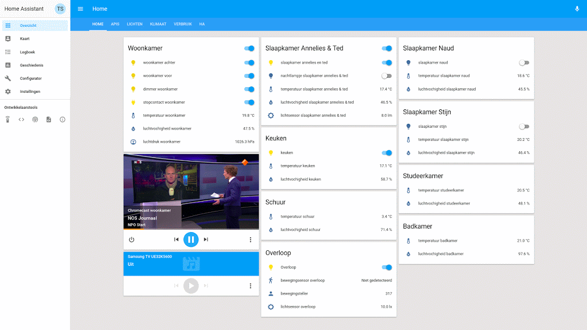
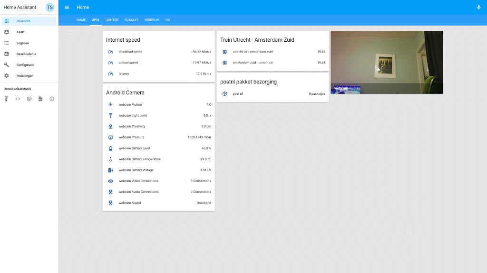
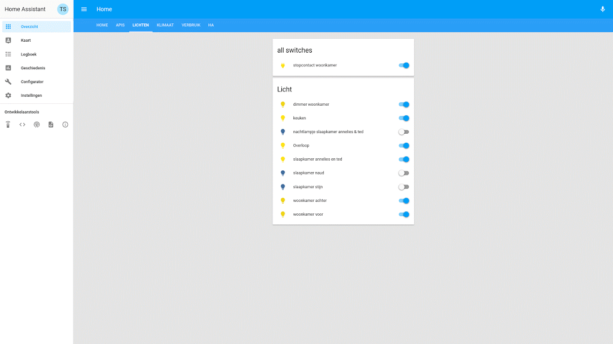
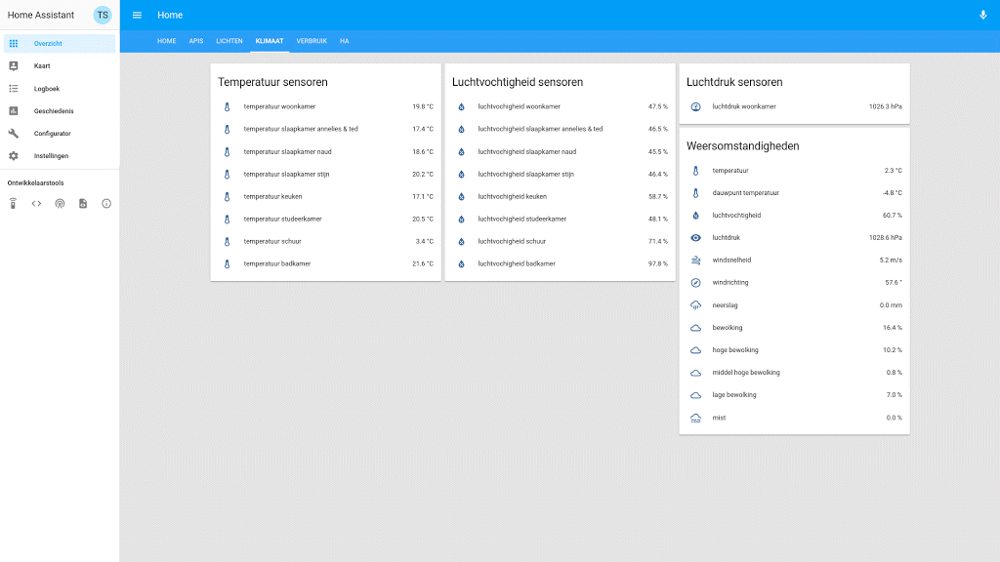
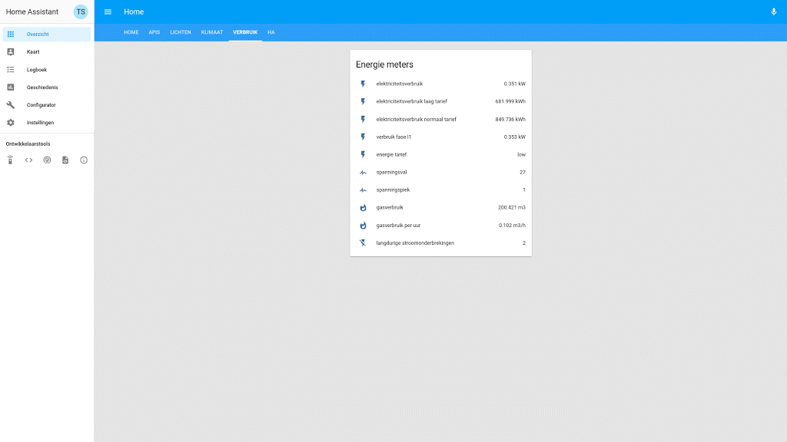
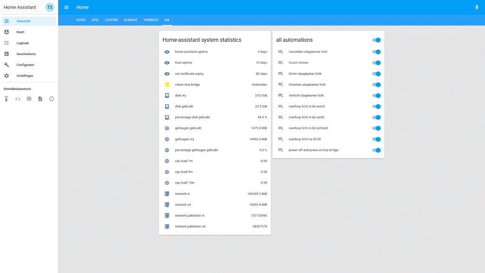
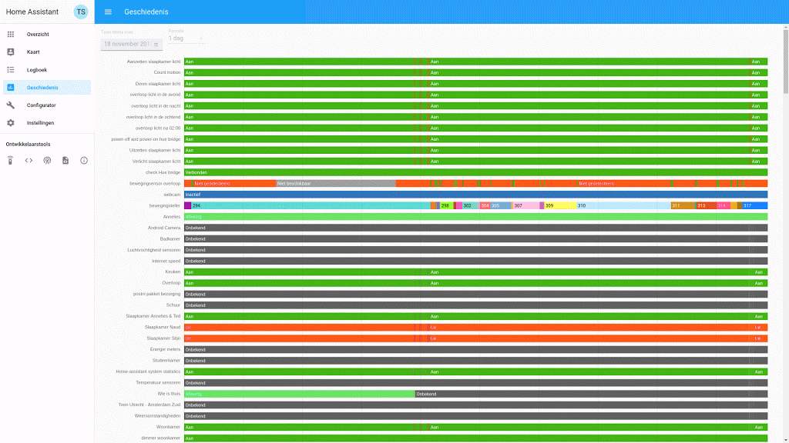

# Home-Assistant configuration  

  
## Features  
  
* SSL/TLS + duckdns domain name + Lets encrypt certificate
* Samsung TV
* Chromecast
* Hue zigbee bridge
* Hue lights
* Hue dimmer
* Hue check & restart bridge
* Xiaomi Aqara zigbee gateway
* Xiaomi Aqara motion & motion couter
* Xiaomi Aqara temperture, pressure and humidity sensors
* Xiaomi Aqara double switch 
* Xiaomi Aqara power plug
* Xiaomi Aqara door & window sensor
* Xiaomi Aqara viberation sensor
* Sonoff Basic
* Sonoff pow r2
* Sonoff 1CH
* Sonoff RF bridge
* MQTT
* yr Weather api
* darksky Weather api
* Buienrader api
* Luftdaten airquality api
* luchtmeetnet api
* Nederlandse Spoorwegen api (dutch railroad)
* internet speed test api
* Postnl api (package delivery)
* Home-Assistant system monitor
* dsmr p1 - slimme meter (energy consumption)
* host uptime
* Home-assistant Uptime
* certificate expiry time
* Mikrotik router 
* Android ip webcam
* Google maps device tracker

## Installation notes

### Preperations

* install docker
* execute: `sudo systemctl enable docker.service && sudo systemctl start docker.service`
* execute: `sudo mkdir /homeassistant/config`
* store home-assistant configuration files in `/homeassistant/config/`
* execute: `sudo chmod 766 /homeassistant/config/*`
* execute: `sudo mkdir /homeassistant/dehydrated`
* execute: `sudo chmod 766 /homeassistant/dehydrated/*`
* clone `https://github.com/lukas2511/dehydrated.git` into `/homeassistant/dehydrated/`
* configure https://github.com/lukas2511/dehydrated

### Homeassistant

* create: [/etc/systemd/system/homeassistant.service](https://raw.githubusercontent.com/tedsluis/Home-AssistantConfig/master/systemd/homeassistant.service)
* execute: `sudo systemctl enable homeassistant.service && sudo systemctl start homeassistant.service`

### MQTT

(optional)
* execute: `sudo mkdir /homeassistant/config/mosquitto` 
* execute: `sudo chmod 777 /homeassistant/config/mosquitto` 
* create: [/homeassistant/config/mosquitto.conf](https://raw.githubusercontent.com/tedsluis/Home-AssistantConfig/master/mosquitto.conf)
* create: [/etc/systemd/system/mqtt.service](https://raw.githubusercontent.com/tedsluis/Home-AssistantConfig/master/systemd/mqtt.service)
* execute: `sudo systemctl enable mqtt.service && sudo systemctl start mqtt.service`
  
  
## Lovelace Home
  

## Lovelace Weer - Weather
  

   
 

   

 
